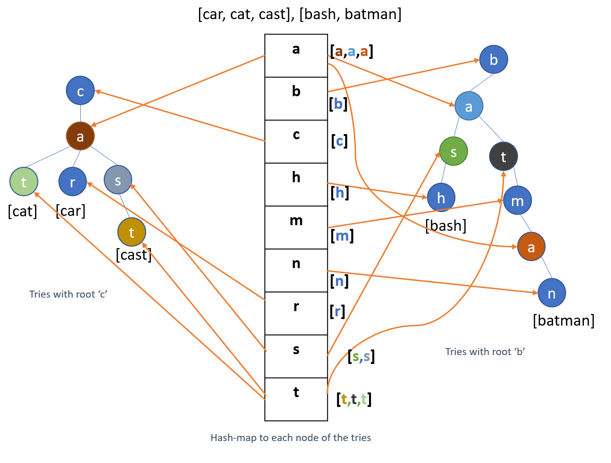

# Hash trie

### Introduction
Hash trie is an enhanced Trie 
data structure stores keyword indexes for faster keyword lookup. The storage is done in such a way that it does efficient memory usage and faster lookup.

### Usage

#### Importing and instantiating

```
from pyhtrie.htrie import Trie
trie = Trie()
```

#### Indexing

> Syntax : trie.index_text(`data`, `keyword_to_index`)

> `data` : Data can be any data to index
> `keyword_to_index` : Keyword associated with the `data` indexed

```
trie.index_text('car','car')
trie.index_text('cat','cat')
trie.index_text('cast','cast')
trie.index_text('Batman', 'batman')
trie.index_text('Bash', 'bash')
```

#### Prefix match

> Syntax : trie.prefix_match(`prefix_text_to_search`)

The function returns all data matching the prefix text

> `prefix_text_to_search` : Will be the prefix text on which the search will be performed. If there are no nodes matching the route of the prefix text then it will return an empty array


```
trie.prefix_match('ca')
```

#### Pattern match

> Syntax : trie.pattern_match(`pattern_text_to_search`)

This function returns all data associated with the text pattern. When compared to the prefix_match function, this function need not necessarily require the `pattern_text_to_search` to match with the prefix of the keyword to be searched for. The `pattern_text_to_search` can appear anywhere within the keyword

> `pattern_text_to_search` : Is the text pattern to be searched. 

```
trie.pattern_match('at')
```

### Storage details

The keywords to be indexed are stored in a Trie data structure as can be seen in the image below. However for faster indexing of pattern match within keywords, each node in the trie is added to the hash-map with the letter corresponding to the node being the key.



So if you need to search for any words beginning with 'ca', then `prefix_match('ca')` will return `[cat, car, cast]` as in a regular trie. However, if you want to search for any words with 'at' in them, you can use the function  `pattern_match('as')` that will return `[cat, batman]`. The prefix match is done with the help of the hash-map. When a prefix match of `'at'` is done, the hash-map is checked for the letter `'a'` in `'at'`. This returns a list of three a nodes `[a,a,a]` each pointing to a correspinding `'a'` node in the tries as shown in the figure above. Then each of them are traversed to see which of them have the next node as `'t'` of `'at'`. The result will be the `'t'` of `'cat'` and the `'t'` preceding `'m'` in `'batman'`. Then the algorithm performs a collection operation from each of these 't's returned to retrieve keywords stored under those t's. The result, as can be inferred from the figure above, will be `[cat, batman]`